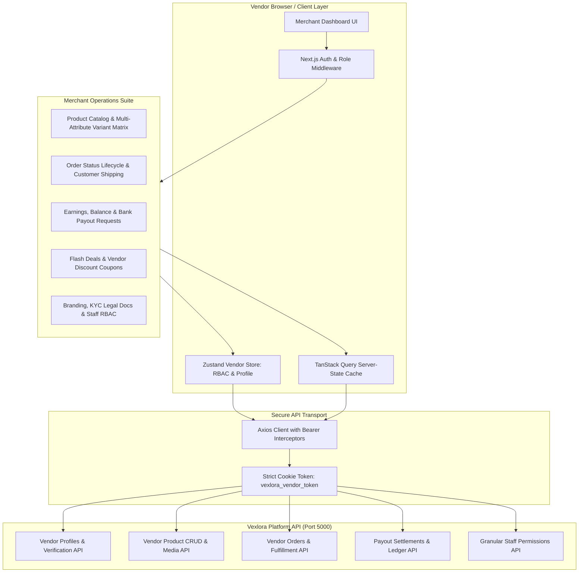

# Vexlora — Vendor & Merchant Management Portal

[](https://nextjs.org/)
[](https://react.dev/)
[](https://www.typescriptlang.org/)
[](https://tailwindcss.com/)
[](https://tanstack.com/query)
[](https://zustand-demo.pmnd.rs/)
[](https://cloudinary.com/)

**Vexlora Vendor Panel** is the dedicated merchant operations and marketplace management interface within the Vexlora ecosystem. Designed for scale and daily store management, it equips sellers with tools for multi-attribute variant inventory management, order fulfillment, payout settlement, flash deal campaigns, vendor-scoped coupons, store branding, and staff role-based access control (RBAC).

---

## 🏗️ Vendor Portal Architecture



---

## ✨ Implemented Merchant Features

### 📊 Vendor Analytics & Operations Dashboard (`/`)
* **Real-Time Performance Metrics**: Store revenue summaries, total orders processed, active product count, and low-inventory alerts.
* **Recent Sales & Fulfillment Ticker**: Live list of incoming customer orders requiring fulfillment with quick-action status updates.

### 📦 Product & Inventory Lifecycle Management (`/products`)
* **Comprehensive Product Catalog**: Paginated data table featuring instant keyword search, status filtering (`DRAFT`, `ACTIVE`, `ARCHIVED`), and category categorization.
* **Product Creation & Editing (`/products/new`, `/products/[id]`)**: Form interface with category/brand select dropdowns, SKU assignments, rich description, and SEO metadata.
* **Multi-Image Media Manager**: Cloudinary-backed multi-image uploader with primary thumbnail selection, reordering, and preview.
* **Multi-Attribute Variant Matrix**: Dynamic matrix builder supporting multi-dimensional attributes (e.g. Size, Color, Material) with independent SKU, barcode, price, discount price, and stock levels per variant combination.
* **Product Status Controls**: Instant toggles for activating, archiving, or drafting products with immediate optimistic UI updates.

### 🚚 Vendor Order Management & Fulfillment (`/orders`)
* **Vendor-Specific Order Isolation**: Sellers view only line items belonging to their store, preserving marketplace data privacy.
* **Order Status Pipeline**: Filterable workflow across `PENDING`, `PROCESSING`, `SHIPPED`, `DELIVERED`, and `CANCELLED`.
* **Fulfillment Details**: Customer shipping address review, line-item pricing breakdowns, customer notes, and tracking number inputs.

### ⚡ Deals & Promotional Campaigns (`/deals`)
* **Deal Submission Engine**: Merchants submit proposals for platform-wide promotions, Flash Sales, and "Today's Hot Deals".
* **Deal Status Tracking**: Visibility into proposal statuses (`PENDING_REVIEW`, `APPROVED`, `REJECTED`, `EXPIRED`) with admin moderation feedback.

### 🏷️ Vendor Coupon System (`/coupons`)
* **Custom Voucher Generator**: Configure percentage-based or fixed-amount discount vouchers.
* **Granular Constraints**: Enforce minimum order spend, maximum discount limits, usage frequency caps, and start/expiration validity windows.

### 💰 Payouts & Financial Settlements (`/payouts`)
* **Earnings & Balance Ledger**: Clear visibility into available balance, pending payouts (escrow/processing), and lifetime gross revenue.
* **Payout Request Engine**: Direct withdrawal submission to verified merchant bank accounts with validation against minimum balance thresholds.
* **Disbursement History**: Chronological log of payout requests, transaction IDs, and settlement statuses.

### 👥 Staff & Granular Role Permissions (`/staff`)
* **Staff Member Delegation**: Invite team members and store managers with dedicated credentials.
* **Permission Matrix**: Granular assignment of functional scopes (e.g., `products:read`, `products:write`, `orders:read`, `orders:update`, `coupons:manage`).

### ⚙️ Store Settings & Verification Hub (`/settings`)
* **Store Branding**: Upload store logo, hero banner, store description, customer support email, and social links.
* **KYC & Legal Documentation**: Submit trade licenses, tax identification numbers (TIN/VAT), and business registration certificates for admin compliance verification.
* **Bank & Payout Details**: Configure beneficiary account name, account number, routing number, and bank branch.
* **Security & Sessions**: Password modification and active session revocation.
* **Store Lifecycle**: Store pause and deactivation controls in the Danger Zone.

---

## 🔄 Vendor Product Lifecycle Flow

```
[ Step 1: Base Information ]
  Enter Title, Slug, Category, Brand, Tags & Detailed Description
        │
[ Step 2: Media Asset Management ]
  Upload High-Resolution Product Images to Cloudinary Storage
        │
[ Step 3: Variant Configuration ]
  Define Attributes (e.g., Size: S, M, L | Color: Black, Navy)
  Generate Matrix → Assign Custom SKU, Unit Price, Sale Price, & Stock per Variant
        │
[ Step 4: Verification & Publish ]
  Validate Schema via Zod → Dispatch Mutation → Set Status (DRAFT or ACTIVE)
        │
[ Step 5: Post-Publish Operations ]
  Monitor Stock Levels, Update Prices, Archive Inactive Lines, or Submit to Flash Deals
```

---

## 🛡️ Authorization & Route Protection

```
                                [ Incoming Request ]
                                         │
                         Next.js Middleware Inspection
                     Cookie: `vexlora_vendor_token` present?
                                ├── No ───> Redirect to `/login`
                                └── Yes ──> Allow Route Access
                                                 │
                                     Zustand Store Initial Check
                                       Fetch User `/users/me`
                                                 │
                                      User Role == 'VENDOR'?
                                ├── No ───> Purge Tokens & Cookies
                                │           Display "Access Denied"
                                └── Yes ──> Hydrate Profile & Permissions
                                                 │
                                   Evaluate Resource Permission
                                   `hasPermission('products:write')`
                                ├── Denied ──> Disable Action / Hide Button
                                └── Granted ─> Allow Operation
```

* **Dedicated Token Namespace**: Uses `vexlora_vendor_token` in cookies and storage, completely isolated from customer and admin credentials to eliminate session collisions during local multi-tenant testing.
* **Strict Role Verification**: Automatically rejects any non-vendor account attempting to authenticate against the merchant portal.
* **Permission Guards**: Hierarchical checks (`*`, `resource:*`, `resource:action`) with automatic owner overrides (`isOwner = true`).

---

## ⚙️ Frontend Engineering & Data Architecture

### 1. TanStack Query Server State Management
* **Declarative Cache Invalidation**: Product updates, order status changes, and coupon creations instantly invalidate corresponding query keys (`useProducts`, `useVendorOrders`, `useVendorCoupons`).
* **Optimistic Local Updates**: Fast UI transitions on toggles and status changes with automatic rollback on error.

### 2. Form Architecture & Type Safety
* Powered by **React Hook Form** with strict **Zod** schema validation across product creation, variant attributes, and store settings.
* Deeply typed data structures reflecting API contracts (`VendorProfile`, `VendorUser`, `VendorOrder`, `ProductVariant`).

### 3. Production UX & Interaction Patterns
* **Interactive Data Tables**: Responsive tables with sorting headers, filter bars, pagination controls, and row action menus.
* **Sonner Toast Feedback**: Real-time feedback for asynchronous actions (save, update, delete, payout request).
* **Skeleton Screen Loading**: Pre-rendered layout skeletons preventing layout shifts during network fetches.
* **Confirmation Dialogs**: Modal confirmations for destructive operations (product archiving, store changes).

---

## 📋 Comprehensive Testing & Verification Matrix

| Feature / Module | Test Scenario | Expected Result | Status |
| :--- | :--- | :--- | :--- |
| **Vendor Login** | Login with valid vendor credentials | `vexlora_vendor_token` cookie set, store hydrated, redirects to `/` | **Verified (Manual E2E)** |
| **Non-Vendor Access Guard** | Customer or Admin tries logging into Vendor Panel | Rejected with "Access restricted to vendor accounts only" error | **Verified (Manual E2E)** |
| **Unauthenticated Redirection** | Direct URL access to `/products` without session | Next.js Middleware intercepts request; redirects immediately to `/login` | **Verified (Manual E2E)** |
| **Product Creation** | Fill required fields, upload images, and submit | Zod validates schema; creates product; redirects to catalog table | **Verified (Manual E2E)** |
| **Variant Matrix Generation** | Add 2 Sizes and 2 Colors | Generates 4 variant combinations with individual SKU and stock inputs | **Verified (Manual E2E)** |
| **Product Status Toggle** | Switch product status from ACTIVE to ARCHIVED | Table updates optimistically; backend status mutation confirmed | **Verified (Manual E2E)** |
| **Order Status Update** | Change order status from PENDING to PROCESSING | Status badge updates, customer tracking timestamp updated | **Verified (Manual E2E)** |
| **Coupon Generation** | Create 20% discount coupon with min spend $50 | Validates bounds; saves coupon; displays in active coupon list | **Verified (Manual E2E)** |
| **Payout Request** | Request payout greater than available balance | Form validation blocks submission; shows insufficient balance warning | **Verified (Manual E2E)** |
| **Valid Payout Submission** | Request payout within available balance limits | Request submitted to admin queue; balance updates to pending | **Verified (Manual E2E)** |
| **KYC Document Upload** | Upload business license PDF and submit | Document URLs saved in vendor profile; status marked pending review | **Verified (Manual E2E)** |
| **RBAC Permission Gate** | Staff member without `products:write` visits editor | Form fields disabled or "Create Product" button hidden | **Verified (Manual E2E)** |
| **Vendor Logout** | Click logout from profile menu | Purges cookies, clears localStorage, redirects to `/login` | **Verified (Manual E2E)** |
| **TypeScript Integrity** | Run `pnpm typecheck` | 0 diagnostic compiler errors across all vendor modules | **Verified (Automated)** |
| **ESLint Compliance** | Run `pnpm lint` | 0 linter violations across all TSX components | **Verified (Automated)** |

---

## 🧰 Tech Stack

| Technology | Purpose | Implementation Path |
| :--- | :--- | :--- |
| **Next.js 16.3.5** | App Router, Server Routing & Middleware | [`src/app/`](src/app), [`src/middleware.ts`](src/middleware.ts) |
| **React 19.2.8** | Component UI Architecture | Core dependency |
| **TypeScript 5.x** | End-to-End Type Safety | [`src/types/`](src/types) |
| **Tailwind CSS v4** | Dark/Light Professional Dashboard Styling | [`src/app/globals.css`](src/app/globals.css) |
| **TanStack Query v5** | Server-State Caching, Polling & Invalidation | [`src/hooks/`](src/hooks) |
| **Zustand v5** | Merchant Session & RBAC Permission Store | [`src/stores/useVendorStore.ts`](src/stores/useVendorStore.ts) |
| **React Hook Form** | High-Performance Controlled Form State | Product & Settings forms |
| **Zod v4** | Strict Runtime Validation Schemas | [`src/schemas/`](src/schemas) |
| **Axios** | HTTP Client with Dynamic Authorization Headers | [`src/lib/api-client.ts`](src/lib/api-client.ts) |
| **Lucide React** | Dashboard & Action Iconography | Shared across navigation & tables |
| **Sonner** | Interactive Notification Toasts | Root layout provider |

---

## 📁 Project Structure

```text
vexlora-vendor/
├── src/
│   ├── app/
│   │   ├── (auth)/                  # Vendor auth routes
│   │   │   ├── login/               # Merchant sign-in
│   │   │   └── register/            # Merchant registration & store creation
│   │   ├── (dashboard)/             # Protected merchant dashboard routes
│   │   │   ├── analytics/           # Sales performance & store metrics
│   │   │   ├── coupons/             # Vendor discount voucher management
│   │   │   ├── deals/               # Flash deal & hot promotional proposals
│   │   │   ├── notifications/       # Real-time order & admin alerts
│   │   │   ├── orders/              # Vendor order fulfillment & line items
│   │   │   ├── payouts/             # Earnings ledger & withdrawal requests
│   │   │   ├── products/            # Catalog, [id] editor & /new product matrix
│   │   │   ├── profile/             # Merchant owner profile
│   │   │   ├── settings/            # Branding, legal docs, bank info, security
│   │   │   ├── staff/               # Staff invitations & RBAC permissions
│   │   │   ├── layout.tsx           # Dashboard shell with sidebar & header
│   │   │   └── page.tsx             # Overview dashboard & KPI cards
│   │   ├── layout.tsx               # Root layout & providers
│   │   └── globals.css              # Dashboard theme tokens
│   ├── components/                  # Reusable tables, modals, uploaders, forms
│   ├── hooks/                       # Domain hooks (useProducts, useVendorOrders, useVendorPayouts)
│   ├── lib/                         # API client & helper utilities
│   ├── middleware.ts                # Next.js route guard for vendor token
│   ├── schemas/                     # Zod validation schemas
│   ├── stores/                      # Zustand merchant state (useVendorStore)
│   └── types/                       # TypeScript models (vendor, orders, products)
├── package.json
└── tsconfig.json
```

---

## 🌟 Engineering Highlights

1. **Combinatorial Variant Matrix Architecture**: Built a multi-attribute inventory engine that dynamically constructs option permutations (Size × Color × Material) with dedicated SKU, pricing, and stock tracking.
2. **Strict Multi-Tenant Session Isolation**: Dedicated cookie and storage token namespaces prevent session cross-contamination between Customer, Merchant, and Administrator portals during simultaneous development.
3. **Enterprise Role-Based Access Control (RBAC)**: Fine-grained permission verification (`hasPermission`) enabling store owners to safely delegate catalog, order, and coupon operations to staff.
4. **Complete KYC Verification Pipeline**: Integrated multi-file legal document upload workflows for merchant business licensing and tax documentation review.
5. **Optimistic Mutation Architecture**: TanStack Query mutations deliver instantaneous UI feedback on stock changes, product activations, and order status transitions.

---

## 🚀 Getting Started

### Prerequisites
* **Node.js**: `v20.x` or higher
* **pnpm**: `v10.x` or higher
* **Backend API**: Running instance of `e-commerce-backend` on port `5000`

### 1. Install Dependencies
```bash
pnpm install
```

### 2. Configure Environment
Create a `.env.local` file in the root directory:
```env
NEXT_PUBLIC_API_URL=http://localhost:5000/api/v1
NEXT_PUBLIC_AUTH_URL=http://localhost:5000/api/v1/auth
```

### 3. Run Development Server
```bash
pnpm dev
```
Navigate to [http://localhost:3000](http://localhost:3000) (or the assigned port).

### 4. Code Quality & Build Checks
```bash
# Typecheck
pnpm typecheck

# Lint
pnpm lint

# Production Build
pnpm build
```
